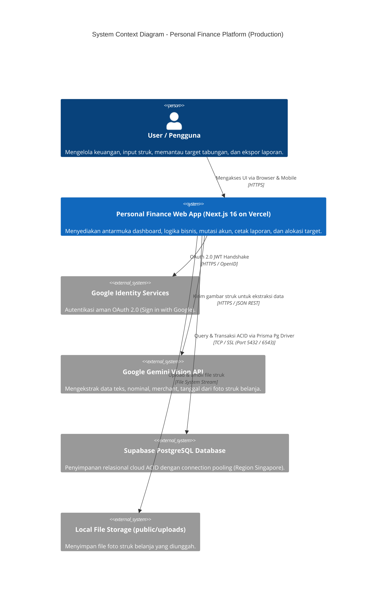
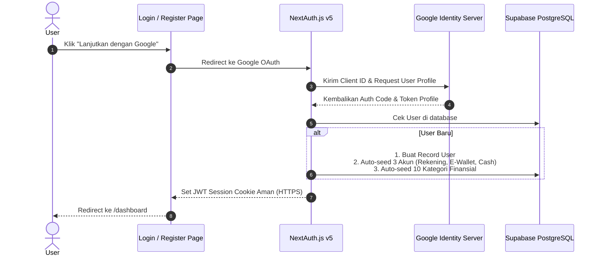
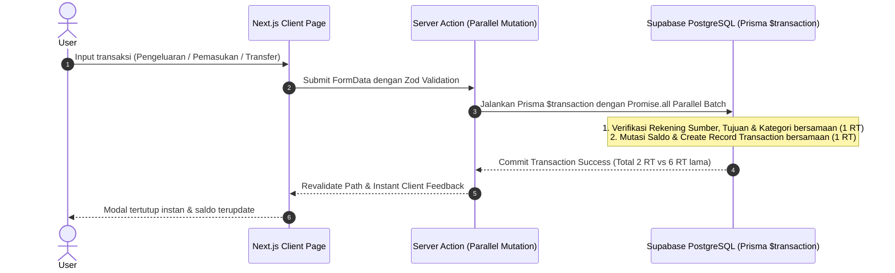
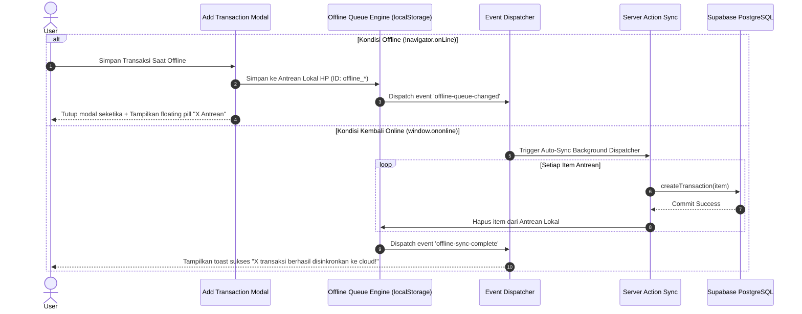
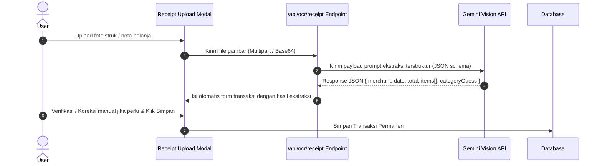
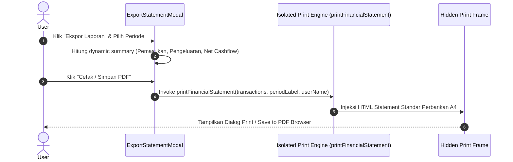

# 🏛️ System Architecture Document (SAD)
## Personal Finance, Multi-Asset & Goal Tracker

---

## 1. Executive Summary & Core Objectives
Aplikasi ini adalah **Modern Full-Stack Personal Finance Platform** yang dirancang untuk mengelola keuangan pribadi secara holistik. Berbeda dengan aplikasi pencatat kas biasa, sistem ini mengintegrasikan:
1. **Multi-Asset & Multi-Account Management** (Rekening Bank, E-Wallet, Cash, dan Portofolio Aset).
2. **Hybrid Goal Vaults** (Target tabungan finansial berbasis alokasi cerdas dari aset riil).
3. **Smart Data Ingestion Engine** (OCR Struk Belanja dengan AI Vision + Batch Bank Statement Parser).
4. **Interactive Financial Statement & Export Hub** (Isolated A4 Print Engine & CSV Spreadsheet Generator).
5. **Real-time Net Worth & Cashflow Analytics** (Batas Belanja Harian Safe-to-Spend berbasis 30 hari standar).
6. **Centralized Settings Hub** (Manajemen profil, batas anggaran, dan kategori kustom).
7. **Cloud-Native & Production Ready** (Supabase Managed PostgreSQL + Google OAuth + Vercel Serverless).

---

## 2. High-Level Architecture (C4 Model Context)

---

## 3. Technology Stack & Decision Matrix

| Layer | Teknologi | Alasan Pemilihan (Architectural Rationale) |
| :--- | :--- | :--- |
| **Framework** | **Next.js 16 (App Router)** | Full-stack terpadu, Server Actions untuk mutasi aman tanpa boilerplate API REST terpisah, Server Components untuk SSR cepat. |
| **Language** | **TypeScript (Strict Mode)** | Type-safety end-to-end dari database schema hingga UI components, mencegah runtime error pada manipulasi nominal uang. |
| **Styling & UI** | **Tailwind CSS v4 + Lucide Icons + Shadcn UI** | Komponen UI modular, aksesibel, responsif untuk perangkat mobile & desktop, tanpa overhead library UI berat. |
| **ORM & DB** | **Prisma ORM 7 + Supabase PostgreSQL (@prisma/adapter-pg)** | Relasi data kuat (ACID), koneksi connection pool aman untuk serverless Vercel, migrasi deklaratif otomatis (`prisma db push`). |
| **Authentication** | **NextAuth.js (Auth.js v5)** | Mendukung ganda: Google OAuth 2.0 dan Credentials (bcrypt), JWT session stateless berkinerja tinggi. |
| **AI / OCR Engine** | **Gemini Flash Vision API (@google/genai)** | Ekstraksi teks nota berkecepatan tinggi, akurasi tinggi membaca struk bahasa Indonesia, biaya efisien (token-based). |
| **Print & Export Engine** | **Isolated Iframe DOM + UTF-8 BOM CSV** | Menjamin hasil cetak PDF A4 bersih (*top-aligned, high-contrast, zero dark-mode artifacts*) dan kompatibel dengan Excel/Google Sheets. |
| **State Management** | **Zustand + React Server Actions + Context API** | State UI lokal yang sangat ringan untuk sensor privasi saldo, offline queue, dan filter data. |
| **PWA & Offline Engine** | **Web App Manifest + Service Worker + Local Queue** | Standalone installability di seluruh perangkat (Mobile, Tablet, Desktop), Stale-While-Revalidate static cache, dan zero-connection transaction queue auto-sync. |
| **UI Architecture** | **Obsidian Sovereign Design System** | Estetika Kinetic Swiss Fintech, Geist Sans/Mono, tabular numerals, specular micro-borders (`border-white/[0.08]`), tactile bevels, dan kartu fisik rekening. |

---

## 4. Subsystem & Component Data Flow

### 4.1. Alur Autentikasi Google OAuth & Auto-Provisioning

### 4.2. Alur Transaksi Harian & Parallel Database Batching (ACID)

### 4.3. Alur PWA & Resilient Offline Queue (Catat Tanpa Sinyal)

### 4.4. Alur Smart OCR Receipt Ingestion

### 4.5. Alur Cetak Laporan Keuangan PDF & CSV

---

## 5. Security & Privacy Architecture

1. **User Data Isolation (Tenant Boundaries)**:
   * Setiap kueri database **wajib** menyertakan filter `where: { userId: session.user.id }`.
   * Akses langsung ke ID transaksi, akun, target, atau kategori pengguna lain dicegah di level Server Actions middleware.
2. **Financial Precision & Integrity**:
   * Nominal uang disimpan dalam format integer (`Int` / `Float` bulat) dalam satuan Rupiah untuk menghindari *floating-point arithmetic error*.
   * Transfer saldo dan alokasi target wajib dieksekusi dalam **Database Transaction (`prisma.$transaction`)** dengan parallel batching untuk menjamin konsistensi saldo dan kecepatan tinggi.
3. **Production Secrets & Environment Protection**:
   * Kunci rahasia (`AUTH_SECRET`, `AUTH_GOOGLE_SECRET`, `DATABASE_URL`, `GEMINI_API_KEY`) dikelola secara aman melalui Vercel Environment Secrets dan tidak pernah disimpan dalam repository publik.
4. **Receipt Storage & Privacy**:
   * Modus sensor privasi (`PrivacyProvider`) menyembunyikan nominal saldo di layar saat digunakan di ruang publik.
5. **Offline Queue Encryption & Local Security**:
   * Antrean transaksi lokal disimpan di storage klien terisolasi dan hanya dapat disinkronkan oleh sesi akun pengguna yang sah.
6. **High-Performance Connection Pooling & Instant UI Invalidation**:
   * PostgreSQL pg.Pool dikonfigurasi dengan *30-second keep-alive* (`idleTimeoutMillis: 30000`) dan kapasitas hingga 10 koneksi simultan untuk menghilangkan penalti koneksi dingin (*cold-start TLS handshake*) 1.5 - 2 detik saat pengguna mencatat transaksi.
   * Client-side modal langsung ditutup seketika (*instant dismiss*), dan penyegaran server dijalankan secara non-blocking via `React.startTransition` bersama invalidasi atomik `revalidatePath('/', 'layout')`.
7. **Deployment Architecture, Vercel Domains & Zero-Crash Resilience**:
   * **Vercel Automatic Subdomain Suffixing**: Vercel secara otomatis menghasilkan subdomain unik (misal: `*-two-teal-14.vercel.app`) untuk mencegah tabrakan nama proyek di lingkup global domain `vercel.app`. Proyek dapat dikonfigurasi ke domain bersih atau custom domain pribadi (misal: `financetracker.id`) melalui menu *Vercel Settings $\rightarrow$ Domains*.
   * **Deployment Chunk Mismatch Auto-Recovery**: Ketika deployment Vercel baru diperbarui, hash chunk JS Next.js berubah. Root dan segment error boundaries (`error.tsx`) dilengkapi pendeteksi otomatis `ChunkLoadError` yang mengeksekusi pemuatan ulang transparan 1x untuk mencegah layar error bagi pengguna yang masih membuka tab lama.
   * **Cookie Sesi Full Navigation**: Transisi login menggunakan `window.location.href` untuk memastikan cookie sesi otentikasi tuntas tersimpan sebelum RSC pertama di-stream dari server Vercel.
8. **Navigation Synchronization & Zero-Stale Client Cache Protocol**:
   * **Dynamic Freshness Navigation (`prefetch={false}`)**: Seluruh tautan navigasi utama pada Desktop Sidebar dan Mobile Bottom Navigation Dock dikonfigurasi dengan `prefetch={false}`. Hal ini mencegah Next.js membekukan RSC payload usang di client-side router cache browser saat pengguna berpindah-pindah tab.
   * **Global Layout Invalidation (`revalidatePath("/", "layout")`)**: Seluruh Server Actions (transaksi, rekening, target tabungan, dan kategori kustom) menginvaliasi root layout secara menyeluruh sehingga saldo dan kalkulasi keuangan di halaman Overview, Transaksi, Analitik, Tabungan, dan Rekening selalu sinkron 100%.
   * **Canonical Route Normalization**: Rute duplikat seperti `/goals` secara otomatis dialihkan melalui server redirect ke `/vaults` untuk mencegah desinkronisasi penanda aktif (*active highlight state*) pada UI navigasi.

