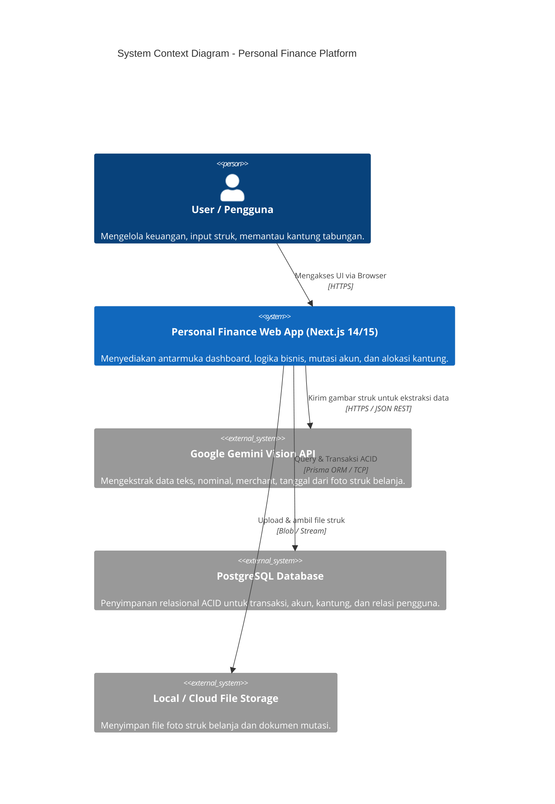
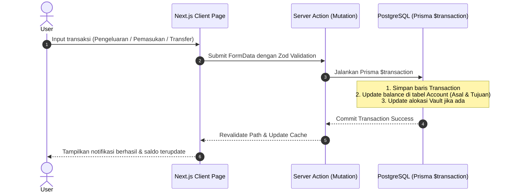
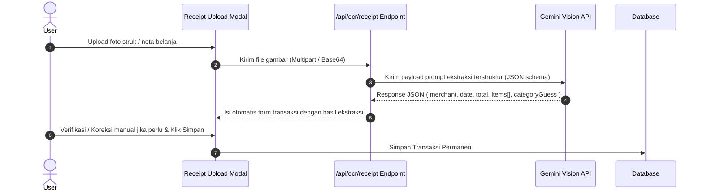

# 🏛️ System Architecture Document (SAD)
## Personal Finance, Multi-Asset & Goal Tracker

---

## 1. Executive Summary & Core Objectives
Aplikasi ini adalah **Modern Full-Stack Personal Finance Platform** yang dirancang untuk mengelola keuangan pribadi secara holistik. Berbeda dengan aplikasi pencatat kas biasa, sistem ini mengintegrasikan:
1. **Multi-Asset & Multi-Account Management** (Rekening Bank, E-Wallet, Cash, dan Portofolio Aset).
2. **Hybrid Goal Vaults** (Kantung target finansial berbasis alokasi cerdas dari aset riil).
3. **Smart Data Ingestion Engine** (OCR Struk Belanja dengan AI Vision + Batch Bank Statement Parser).
4. **Real-time Net Worth & Cashflow Analytics**.

---

## 2. High-Level Architecture (C4 Model Context)

---

## 3. Technology Stack & Decision Matrix

| Layer | Teknologi | Alasan Pemilihan (Architectural Rationale) |
| :--- | :--- | :--- |
| **Framework** | **Next.js 14/15 (App Router)** | Full-stack terpadu, Server Actions untuk mutasi aman tanpa boilerplate API REST terpisah, Server Components untuk SSR cepat. |
| **Language** | **TypeScript (Strict Mode)** | Type-safety end-to-end dari database schema hingga UI components, mencegah runtime error pada manipulasi nominal uang. |
| **Styling & UI** | **Tailwind CSS + Lucide Icons + Shadcn UI** | Komponen UI modular, aksesibel, responsif untuk perangkat mobile & desktop, tanpa overhead library UI berat. |
| **ORM & DB** | **Prisma ORM + PostgreSQL** | Relasi data kuat (ACID), migrasi deklaratif otomatis, dukungan atomic transactions (`$transaction`) untuk transfer saldo. |
| **Authentication** | **NextAuth.js (Auth.js v5)** | Standar industri untuk Next.js, mendukung JWT session berbasis User ID dan integrasi OAuth / Credentials yang aman. |
| **AI / OCR Engine** | **Gemini 1.5/2.0 Flash Vision API** | Ekstraksi teks nota berkecepatan tinggi, akurasi tinggi membaca struk bahasa Indonesia, biaya efisien (token-based). |
| **State Management** | **Zustand + React Server Actions** | State UI lokal yang sangat ringan tanpa boilerplate Redux. |

---

## 4. Subsystem & Component Data Flow

### 4.1. Alur Transaksi Harian & Transfer Saldo

### 4.2. Alur Smart OCR Receipt Ingestion

---

## 5. Security & Privacy Architecture

1. **User Data Isolation (Tenant Boundaries)**:
   * Setiap kueri database **wajib** menyertakan filter `where: { userId: session.user.id }`.
   * Akses langsung ke ID transaksi atau akun lain dicegah di level Server Actions middleware.
2. **Financial Precision & Integrity**:
   * Nominal uang disimpan dalam format integer (`BigInt` / `Int` dalam satuan terkecil / Rupiah) atau `Decimal(15, 2)` untuk menghindari *floating-point arithmetic error* di JavaScript.
   * Transfer saldo dan alokasi kantung wajib dieksekusi dalam **Database Transaction (`prisma.$transaction`)** untuk menjamin konsistensi saldo.
3. **Receipt Storage & Privacy**:
   * Struk yang diupload hanya dapat diakses oleh user pemilik melalui URL bertanda tangan (*signed URL*) atau stream privat.

---

## 6. Non-Functional Requirements (NFR)
* **P95 Latency**: Dashboard data fetch < 300ms via Server Side Rendering (SSR) & Indexing.
* **Responsive Layout**: Desain Mobile-First (cocok untuk input cepat di smartphone) dan Desktop-Ready (analitik lebar).
* **Fail-Safe OCR**: Jika Vision API gagal memproses struk yang buram, UI otomatis beralih ke mode input manual dengan foto tetap tersimpan sebagai lampiran.
