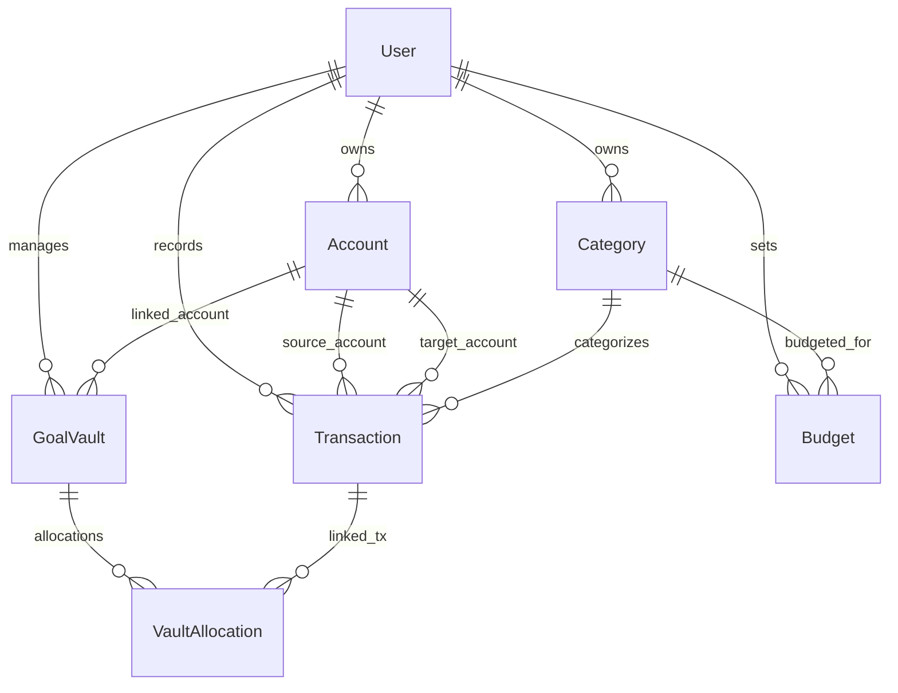

# 🗄️ Database Design & Schema Specification
## SQLite / PostgreSQL + Prisma ORM

---

## 1. Entity Relationship Overview

Berikut adalah diagram relasi entitas antar tabel di database:



---

## 2. Complete Prisma Schema (`prisma/schema.prisma`)

```prisma
datasource db {
  provider = "sqlite"
}

generator client {
  provider = "prisma-client-js"
}

// ----------------------------------------------------
// 1. User & Authentication
// ----------------------------------------------------
model User {
  id                   String         @id @default(cuid())
  name                 String?
  email                String         @unique
  emailVerified        DateTime?
  passwordHash         String?
  image                String?
  monthlySpendingLimit Float          @default(0)
  createdAt            DateTime       @default(now())
  updatedAt            DateTime       @updatedAt

  accounts             Account[]
  categories           Category[]
  transactions         Transaction[]
  goalVaults           GoalVault[]
  budgets              Budget[]

  @@map("users")
}

// ----------------------------------------------------
// 2. Accounts / Dompet & Rekening Aset
// ----------------------------------------------------
model Account {
  id              String         @id @default(cuid())
  userId          String
  name            String         // misal: "BCA Tahapan", "GoPay Utama"
  type            String         @default("BANK") // BANK, EWALLET, CASH, INVESTMENT, CREDIT_CARD
  balance         Float          @default(0)
  currency        String         @default("IDR")
  color           String?        // Hex code (#0052CC)
  icon            String?        // Identifier icon (landmark, wallet, coins)
  accountNumber   String?        // 4 digit terakhir (opsional)
  isArchived      Boolean        @default(false)
  createdAt       DateTime       @default(now())
  updatedAt       DateTime       @updatedAt

  user            User           @relation(fields: [userId], references: [id], onDelete: Cascade)
  outTransactions Transaction[]  @relation("SourceAccount")
  inTransactions  Transaction[]  @relation("TargetAccount")
  linkedVaults    GoalVault[]    @relation("LinkedAccount")

  @@index([userId])
  @@map("accounts")
}

// ----------------------------------------------------
// 3. Categories (Pemasukan & Pengeluaran)
// ----------------------------------------------------
model Category {
  id          String        @id @default(cuid())
  userId      String?       // Null = Default System Category, Non-null = User Custom Category
  name        String        // misal: "Makanan & Minuman", "Gaji", "Transportasi"
  type        String        @default("EXPENSE") // EXPENSE, INCOME
  icon        String?       // Lucide icon name (utensils, car, briefcase)
  color       String?       // Hex color code
  isDefault   Boolean       @default(false)
  createdAt   DateTime      @default(now())
  updatedAt   DateTime      @updatedAt

  user         User?         @relation(fields: [userId], references: [id], onDelete: Cascade)
  transactions Transaction[]
  budgets      Budget[]

  @@index([userId])
  @@map("categories")
}

// ----------------------------------------------------
// 4. Transactions (Pencatatan Keuangan Harian)
// ----------------------------------------------------
model Transaction {
  id              String            @id @default(cuid())
  userId          String
  accountId       String            // Akun Sumber
  targetAccountId String?           // Khusus TRANSFER (Akun Tujuan)
  categoryId      String?           // Opsional untuk transfer
  type            String            @default("EXPENSE") // EXPENSE, INCOME, TRANSFER
  amount          Float
  date            DateTime          @default(now())
  description     String?
  receiptUrl      String?           // File foto struk belanja
  rawOcrJson      String?           // Metadata JSON hasil parse Vision OCR
  createdAt       DateTime          @default(now())
  updatedAt       DateTime          @updatedAt

  user            User              @relation(fields: [userId], references: [id], onDelete: Cascade)
  account         Account           @relation("SourceAccount", fields: [accountId], references: [id], onDelete: Cascade)
  targetAccount   Account?          @relation("TargetAccount", fields: [targetAccountId], references: [id], onDelete: SetNull)
  category        Category?         @relation(fields: [categoryId], references: [id], onDelete: SetNull)
  allocations     VaultAllocation[]

  @@index([userId, date])
  @@index([accountId])
  @@index([categoryId])
  @@map("transactions")
}

// ----------------------------------------------------
// 5. Goal Vaults (Target Tabungan Finansial)
// ----------------------------------------------------
model GoalVault {
  id              String            @id @default(cuid())
  userId          String
  linkedAccountId String?           // Opsional: Rekening fisik yang memegang uang ini
  name            String            // misal: "Dana Darurat", "Liburan Jepang"
  targetAmount    Float
  currentAmount   Float             @default(0)
  deadline        DateTime?
  color           String?
  icon            String?
  status          String            @default("ACTIVE") // ACTIVE, ACHIEVED, PAUSED
  createdAt       DateTime          @default(now())
  updatedAt       DateTime          @updatedAt

  user            User              @relation(fields: [userId], references: [id], onDelete: Cascade)
  linkedAccount   Account?          @relation("LinkedAccount", fields: [linkedAccountId], references: [id], onDelete: SetNull)
  allocations     VaultAllocation[]

  @@index([userId])
  @@map("goal_vaults")
}

// ----------------------------------------------------
// 6. Vault Allocations (Riwayat Alokasi Tabungan)
// ----------------------------------------------------
model VaultAllocation {
  id            String          @id @default(cuid())
  vaultId       String
  transactionId String?
  amount        Float
  type          String          @default("DEPOSIT") // DEPOSIT, WITHDRAW
  date          DateTime        @default(now())
  note          String?

  vault         GoalVault       @relation(fields: [vaultId], references: [id], onDelete: Cascade)
  transaction   Transaction?    @relation(fields: [transactionId], references: [id], onDelete: SetNull)

  @@index([vaultId])
  @@map("vault_allocations")
}

// ----------------------------------------------------
// 7. Budgets (Batas Pengeluaran Bulanan per Kategori)
// ----------------------------------------------------
model Budget {
  id          String    @id @default(cuid())
  userId      String
  categoryId  String
  amount      Float
  month       Int       // 1-12
  year        Int       // misal: 2026
  createdAt   DateTime  @default(now())
  updatedAt   DateTime  @updatedAt

  user        User      @relation(fields: [userId], references: [id], onDelete: Cascade)
  category    Category  @relation(fields: [categoryId], references: [id], onDelete: Cascade)

  @@unique([userId, categoryId, month, year])
  @@map("budgets")
}
```

---

## 3. Indexing & Query Optimization Strategy

1. **Composite Index `[userId, date]`**:
   * Mempercepat filter riwayat transaksi bulanan dan kalkulasi *cashflow* dashboard tanpa *full-table scan*.
2. **Relasi Cascading vs SetNull**:
   * Menghapus `Account` atau `Category` mengubah relasi di tabel `Transaction` menjadi `SetNull` agar buku mutasi masa lalu tetap utuh dan audit trail tidak hilang.
3. **Penyimpanan Angka Rupiah**:
   * Disimpan dalam nilai murni Rupiah yang menjamin performa kalkulasi tinggi dan kompatibilitas lintas SQLite & PostgreSQL.
