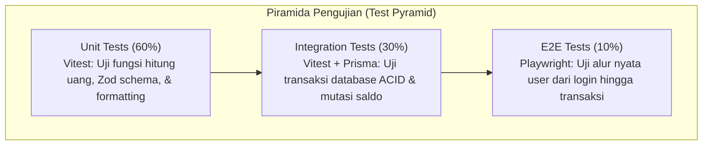

# 🧪 Comprehensive QA Test Plan & Testing Strategy
## Personal Finance, Multi-Asset & Goal Tracker

---

## 1. Executive Strategy & Testing Philosophy

Sistem finansial membutuhkan standar pengujian yang ketat karena menyangkut akurasi angka dan kepercayaan pengguna. Filosofi pengujian kami berfokus pada **Zero-Balance Inconsistency** (tidak ada selisih saldo), **Fail-Safe Ingestion** (penanganan kesalahan input yang aman), dan **Strict Tenant Isolation** (isolasi data antar-pengguna 100%).



---

## 2. Test Suites & Skenario Pengujian

### 2.1. Unit Testing Suite (`Vitest`)

Fokus: Menguji fungsi-fungsi murni (*pure functions*), utilitas matematika, dan validasi skema input.

| ID | Modul | Skenario Pengujian | Input Test | Ekspektasi Output | Status |
| :--- | :--- | :--- | :--- | :--- | :---: |
| **UT-01** | `lib/currency.ts` | Format nominal angka ke Rupiah standar | `1250000` | `"Rp 1.250.000"` | ⏳ Pending |
| **UT-02** | `lib/currency.ts` | Format nominal desimal / sen | `1250000.50` | `"Rp 1.250.000,50"` | ⏳ Pending |
| **UT-03** | `lib/currency.ts` | Parsing string input pengguna ke Decimal | `"1.500.000"` | `1500000` (Number/Decimal) | ⏳ Pending |
| **UT-04** | `features/transactions/schema.ts` | Validasi input nominal negatif / nol | `amount: -50000` atau `0` | ❌ Zod Error: "Nominal harus lebih dari 0" | ⏳ Pending |
| **UT-05** | `features/transactions/schema.ts` | Validasi tanggal transaksi masa depan | `date: "2099-01-01"` | ❌ Zod Error: "Tanggal tidak valid" | ⏳ Pending |
| **UT-06** | `features/vaults/schema.ts` | Validasi target kantung tabungan | `targetAmount: 0` | ❌ Zod Error: "Target minimal Rp 10.000" | ⏳ Pending |
| **UT-07** | `features/analytics/calculator.ts` | Kalkulasi saldo aman belanja (*Safe-to-Spend*) | Total Saldo: 10Jt, Tagihan: 3Jt, Alokasi Kantung: 2Jt | Saldo Bebas: tepat **Rp 5.000.000** | ⏳ Pending |

---

### 2.2. Integration Testing Suite (`Vitest` + PostgreSQL / Prisma)

Fokus: Menguji kebenaran mutasi data pada database dan integritas transaksi atomik (`$transaction`).

| ID | Modul | Skenario Pengujian | Aksi & Verifikasi Database | Status |
| :--- | :--- | :--- | :--- | :---: |
| **IT-01** | `createTransaction` | Catat Pengeluaran Baru | 1. Baris transaksi tersimpan.<br/>2. Saldo akun sumber berkurang tepat sebesar nominal.<br/>3. Net worth berkurang. | ⏳ Pending |
| **IT-02** | `createTransaction` | Catat Pemasukan Baru | 1. Baris transaksi tersimpan.<br/>2. Saldo akun bertambah.<br/>3. Net worth bertambah. | ⏳ Pending |
| **IT-03** | `transferFunds` | **Atomic Inter-Account Transfer** | 1. Saldo Akun Asal (BCA) berkurang Rp 100.000.<br/>2. Saldo Akun Tujuan (GoPay) bertambah Rp 100.000.<br/>3. Net worth total **tidak berubah** (tetap konstan). | ⏳ Pending |
| **IT-04** | `transferFunds` | **Simulasi Rollback Gagal** | Jika database sengaja diputus di tengah transfer: kedua saldo akun **wajib kembali ke saldo awal** (tidak ada uang hilang/nyangkut). | ⏳ Pending |
| **IT-05** | `deleteTransaction` | Hapus Riwayat Pengeluaran | Saldo akun sumber otomatis dikembalikan (*refund*) sebesar nominal transaksi yang dihapus. | ⏳ Pending |
| **IT-06** | `allocateVault` | Alokasi Dana ke Kantung Tabungan | 1. Saldo akun simpanan terkunci/berkurang dari saldo bebas.<br/>2. `currentAmount` pada kantung bertambah. | ⏳ Pending |

---

### 2.3. AI OCR & Receipt Ingestion Suite

Fokus: Menguji ketahanan integrasi Google Gemini Vision API dan parser struk.

| ID | Skenario Pengujian | Sampel Data Uji | Kriteria Keberhasilan | Status |
| :--- | :--- | :--- | :--- | :---: |
| **OCR-01** | Ekstraksi Struk Minimarket Jelas | Foto struk Indomaret / Alfamart berkualitas baik | Terbaca tepat: `Merchant: Indomaret`, `Total: Rp 45.500`, `Date: 2026-08-23`. | ⏳ Pending |
| **OCR-02** | Ekstraksi Struk Restoran / Cafe | Struk kafe dengan rincian makanan & minuman | Berhasil mem-parse nominal total dan menyarankan kategori `"Makanan & Minuman"`. | ⏳ Pending |
| **OCR-03** | **Handling Gambar Buram / Gelap** | Foto struk buram / teks tidak terbaca | Sistem tidak error 500, melainkan mengembalikan response: *"Teks struk kurang jelas, silakan lengkapi nominal secara manual"*. | ⏳ Pending |
| **OCR-04** | Upload File Non-Gambar | File berekstensi `.exe` atau `.txt` | Ditolak di level validasi upload sebelum dikirim ke AI API. | ⏳ Pending |

---

### 2.4. End-to-End (E2E) Browser Testing Suite (`Playwright`)

Fokus: Menguji pengalaman pengguna nyata di browser desktop dan mobile.

```text
[E2E Flow 1: Auth & Onboarding]
Buka /register -> Isi Email & Password -> Masuk Dashboard -> Kategori default otomatis muncul di menu settings.

[E2E Flow 2: Catat Transaksi Cepat]
Klik tombol "+ Transaksi" -> Pilih Akun "BCA" -> Kategori "Makanan" -> Masukkan "35000" -> Klik Simpan -> Notifikasi Toast muncul -> Saldo BCA di kartu atas berkurang 35.000.

[E2E Flow 3: Transfer Dana]
Klik tombol "Transfer" -> Pilih Dari "BCA" ke "GoPay" -> Nominal "100000" -> Klik Kirim -> Kartu BCA berkurang 100rb, Kartu GoPay bertambah 100rb.

[E2E Flow 4: OCR Scanner Struk]
Klik tombol "Scan Struk" -> Upload file foto nota -> Tunggu animasi scanner -> Form otomatis terisi -> Klik Konfirmasi Simpan.

[E2E Flow 5: Mobile Viewport 375px]
Buka aplikasi pada resolusi iPhone SE (375x667) -> Pastikan tidak ada scroll horizontal -> Bottom Navigation bar berfungsi normal.
```

---

### 2.5. Security & Multi-Tenant Isolation Testing

| ID | Skenario Pengujian | Metode Pengujian | Ekspektasi |
| :--- | :--- | :--- | :--- |
| **SEC-01** | **Cross-User Data Isolation** | User A mencoba mengakses API dengan ID transaksi milik User B (`/api/transactions/userB-tx-id`). | Wajib me-return status `403 Forbidden` / `404 Not Found`. |
| **SEC-02** | **Session Hijacking Prevention** | Request tanpa header cookie JWT sesi yang valid ke rute dashboard. | Otomatis di-redirect ke halaman `/login`. |
| **SEC-03** | **XSS Input Sanitization** | Mengisi deskripsi transaksi dengan skrip: `<script>alert('hack')</script>`. | Karakter di-escape dengan aman dan tidak dieksekusi di DOM browser. |

---

## 3. Tooling & Infrastruktur Pengujian

* **Test Runner**: [Vitest](https://vitest.dev/) (Eksekusi super cepat berbasis ESM dan terintegrasi native dengan Vite/Next.js).
* **Browser Automation**: [Playwright](https://playwright.dev/) (Mendukung pengujian headless pada Chromium, WebKit/Safari, dan Firefox di desktop & mobile viewport).
* **Database Mocking / Test DB**: PostgreSQL test container / SQLite in-memory untuk pengujian isolasi cepat.

---

## 4. Definition of Done (DoD) & Quality Gates

Sebuah fitur dianggap **SELESAI (Done)** hanya jika memenuhi kriteria berikut:
1. ✅ Semua Unit Test terkait fitur lulus 100%.
2. ✅ Integration Test database mutasi saldo teruji tanpa desinkronisasi.
3. ✅ Tidak ada peringatan Type Error (`tsc --noEmit` lolos).
4. ✅ Tidak ada peringatan Linter (`npm run lint` bersih).
5. ✅ E2E Playwright test untuk *critical user path* berhasil dieksekusi.
