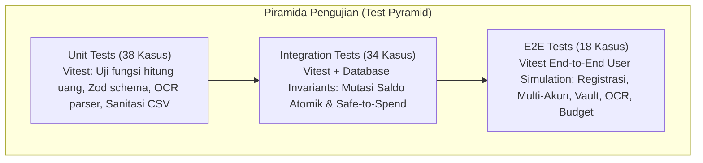

# 🧪 Comprehensive QA Test Plan & Testing Strategy
## Personal Finance, Multi-Asset & Goal Tracker

---

## 1. Executive Strategy & Testing Philosophy

Sistem finansial membutuhkan standar pengujian yang ketat karena menyangkut akurasi angka dan kepercayaan pengguna. Filosofi pengujian kami berfokus pada **Zero-Balance Inconsistency** (tidak ada selisih saldo), **Fail-Safe Ingestion** (penanganan kesalahan input yang aman), dan **Strict Tenant Isolation** (isolasi data antar-pengguna 100%).

---

## 2. Test Suites & Skenario Pengujian

### 2.1. Ringkasan Status Uji Aktual

| No | Berkas Uji (`tests/unit/`) | Cakupan Pengujian | Jumlah Kasus | Status |
| :--- | :--- | :--- | :---: | :---: |
| 1 | `currency.test.ts` | Format Rupiah, parsing desimal, dan sanitasi input mata uang | 4 | ✅ Passed |
| 2 | `auth-schema.test.ts` | Validasi Zod pendaftaran akun, login, dan kompleksitas sandi | 5 | ✅ Passed |
| 3 | `account-schema.test.ts` | Validasi rekening bank, e-wallet, cash, dan transfer dana | 6 | ✅ Passed |
| 4 | `transactions.test.ts` | CRUD transaksi, mutasi saldo, filter, dan bulk import CSV | 12 | ✅ Passed |
| 5 | `ocr.test.ts` | Ekstraksi Gemini AI Vision, parsing JSON struk, fallback cerdas | 4 | ✅ Passed |
| 6 | `goals.test.ts` | Alokasi saldo target tabungan, penarikan, dan transisi status | 10 | ✅ Passed |
| 7 | `analytics.test.ts` | Health score, Safe-to-Spend (30 hari), dan rasio tabungan | 8 | ✅ Passed |
| 8 | `qa-matrix.test.ts` | Matriks integritas multi-rekening dan skenario batas nominal | 17 | ✅ Passed |
| 9 | `e2e-comprehensive-qa.test.ts` | Simulasi alur lengkap pengguna nyata dari hulu ke hilir | 18 | ✅ Passed |
| 10 | `settings.test.ts` | Update profil, sanitasi limit belanja, proteksi kategori default | 4 | ✅ Passed |
| 11 | `export-statement.test.ts` | Sanitasi CSV UTF-8 BOM, kalkulasi porsi kategori rekening koran | 4 | ✅ Passed |
| 12 | `offline-queue.test.ts` | Antrean transaksi offline, auto-sync background, dan failover | 6 | ✅ Passed |
| 13 | `transfer-interaccount.test.ts` | Resolusi tabrakan UI, swap transfer, validasi transfer ACID, dan konservasi saldo | 11 | ✅ Passed |
| 14 | `account-sorting.test.ts` | Pengurutan saldo Ascending & Descending, tie-breaker deterministik, toleransi ekstrem | 9 | ✅ Passed |
| 15 | `mutation-responsiveness.test.ts` | Responsivitas mutasi saldo/Net Worth, warm pool connection keepalive, transisi atomik | 5 | ✅ Passed |
| 16 | `navigation-sync.test.ts` | Hierarki navigasi, single-active invariant, cross-page Net Worth sync, instant optimistic state, dan error boundary cooldown | 21 | ✅ Passed |
| **TOTAL** | **16 Berkas Uji** | **Seluruh Modul, Navigasi & Invarian Finansial** | **144 Tests** | **✅ 100% Passed** |

---

### 2.2. Unit & Integration Testing Breakdown

#### A. Integritas Transaksi & Saldo Atomik (ACID)
* **UT-01**: Format Rupiah standar (`formatRupiah(1250000)` $\rightarrow$ `"Rp 1.250.000"`).
* **IT-01**: Catat pengeluaran baru $\rightarrow$ saldo rekening sumber berkurang tepat sebesar nominal.
* **IT-02**: Catat pemasukan baru $\rightarrow$ saldo rekening bertambah.
* **IT-03**: Transfer antar-rekening $\rightarrow$ saldo asal berkurang, saldo tujuan bertambah, **Net Worth total tetap konstan**.
* **IT-04**: Hapus transaksi pengeluaran $\rightarrow$ saldo otomatis di-*refund* kembali.

#### B. Target Tabungan Mandiri (Financial Goals)
* **GT-01**: Alokasi dana ke target tabungan $\rightarrow$ saldo bebas rekening berkurang, alokasi target bertambah.
* **GT-02**: Penarikan dana dari target tabungan $\rightarrow$ dana kembali ke saldo bebas rekening.
* **GT-03**: Ketika akumulasi alokasi $\ge$ target nominal $\rightarrow$ status otomatis berubah menjadi `ACHIEVED`.

#### C. Safe-to-Spend & Analitik
* **AT-01**: Menghitung batas belanja harian dengan formula flat 30 hari:
  $$\text{Daily Safe Amount} = \left\lfloor \frac{\text{Monthly Spending Limit}}{30} \right\rfloor$$
* **AT-02**: Evaluasi skor kesehatan finansial berdasarkan rasio tabungan dan arus kas bulanan.

#### D. Pengaturan & Kategori Kustom
* **ST-01**: Update profil pengguna dan sinkronisasi nama ke sesi header/sidebar secara instan.
* **ST-02**: Proteksi invariant: Kategori sistem (*default*) tidak dapat dihapus oleh pengguna.
* **ST-03**: Pembuatan kategori kustom baru terisolasi khusus untuk pengguna yang bersangkutan.

#### E. Ekspor Laporan & Cetak Dokumen PDF
* **EX-01**: Ekspor file CSV lengkap dengan **UTF-8 BOM** (`\uFEFF`) agar langsung terbaca rapi di Microsoft Excel.
* **EX-02**: Sanitasi karakter tanda kutip (*escaping quotes*) pada deskripsi transaksi.
* **EX-03**: Kalkulasi porsi pengeluaran per kategori pada tabel rekening koran sesuai total mutasi aktual.

#### F. Navigasi Cepat, Sinkronisasi Cross-Page & Ketahanan Error Boundary
* **NAV-01**: *Single-Active Route Invariant* — Memastikan hanya tepat 1 item navigasi yang aktif saat membuka URL tertentu, termasuk penanganan alias `/goals` $\rightarrow$ `/vaults`.
* **NAV-02**: *Cross-Page Math Invariant* — Total Net Worth di `/dashboard` sama persis secara matematis dengan Net Worth di `/accounts`, dan Cashflow di `/transactions` identik dengan `/dashboard` dan `/analytics`.
* **NAV-03**: *Instant Optimistic Transition (0ms)* — State tab langsung berpindah dalam 0 milidetik saat diklik pengguna tanpa menunggu respon jaringan.
* **NAV-04**: *Cooldown Throttle Protection (15 Detik)* — Error boundary secara otomatis membatasi auto-reload dalam jendela 15 detik untuk mencegah *infinite reload loop*.
* **NAV-05**: *Safe Fallback Contracts* — Seluruh fungsi pembacaan data (`accounts`, `transactions`, `goals`, `analytics`, `settings`) mengembalikan objek default yang valid saat terjadi kegagalan jaringan atau timeout.

---

### 2.3. Keamanan & Multi-Tenant Data Isolation
* **SEC-01**: Setiap kueri database memfilter `where: { userId }` sehingga data antar-pengguna terisolasi 100%.
* **SEC-02**: Proteksi rute dashboard (`/dashboard`, `/transactions`, `/accounts`, `/goals`, `/analytics`, `/settings`) mengalihkan pengguna tanpa sesi ke `/login`.
* **SEC-03**: Sanitasi input teks bebas mencegah eksekusi skrip berbahaya (*XSS protection*).
* **SEC-04**: Mode bypass dev otomatis dinonaktifkan di environment produksi (`NODE_ENV === 'production'`).
* **SEC-05**: Google OAuth token handshake terenkripsi JWT dan diverifikasi secara stateless.
* **SEC-06**: Database cloud PostgreSQL dilindungi connection pooler dengan enkripsi SSL.
