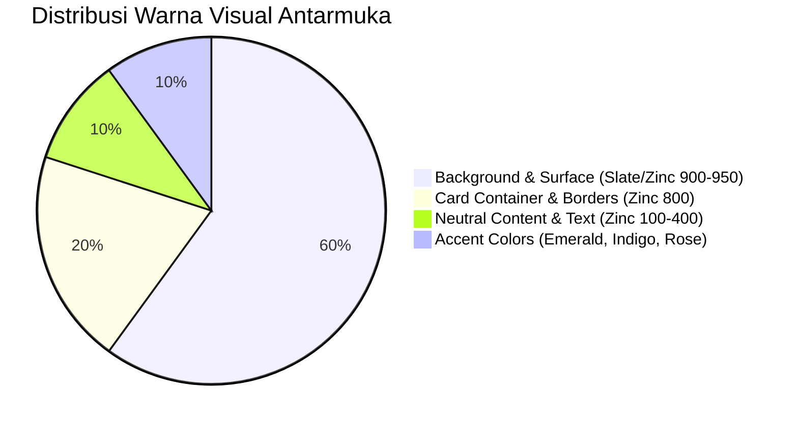

# 🎨 UI/UX Design System & Experience Specification
## Personal Finance, Multi-Asset & Goal Tracker
*Generated via `ui-ux-pro-max` Design Intelligence*

---

## 1. Visual Theme & Personality
* **Design Philosophy**: *High-Trust Modern Fintech* (Kombinasi estetika **Bento Grid** bergaya Linear/Mercury dengan sentuhan halus **Glassmorphism**).
* **Target Feeling**: Profesional, bersih, presisi finansial, aman, dan intuitif digunakan dalam 1 tangan di layar smartphone.
* **Natural Language**: Istilah yang digunakan bersifat natural perbankan modern: *Target Tabungan Mandiri*, *Rekening & Dompet Digital*, *Buku Mutasi Transaksi*, dan *Batas Belanja Aman (Safe-to-Spend)*.

---

## 2. Color Palette & Design Tokens



| Token Role | Hex Code | Tailwind Class | Kegunaan |
| :--- | :--- | :--- | :--- |
| **Canvas Background** | `#09090B` | `bg-zinc-950` | Latar belakang utama dashboard. |
| **Card Surface** | `#18181B` / 80% | `bg-zinc-900/80 backdrop-blur-md` | Kartu statistik, modal, dan container widget. |
| **Card Border** | `#27272A` | `border-zinc-800` | Garis batas kartu (1px solid). |
| **Income / Net Worth** | `#10B981` | `text-emerald-500 bg-emerald-500/10` | Pemasukan, pertumbuhan saldo positif, indikator aman. |
| **Expense / Alert** | `#F43F5E` | `text-rose-500 bg-rose-500/10` | Pengeluaran, peringatan batas budget, saldo defisit. |
| **Primary Accent / Goals** | `#3B82F6` | `text-blue-500 bg-blue-500/10` | Tombol aksi utama (CTA), target tabungan finansial. |
| **Transfer / Neutral** | `#A855F7` | `text-purple-500 bg-purple-500/10` | Mutasi transfer antar-rekening/dompet. |
| **Text Primary** | `#F4F4F5` | `text-zinc-100` | Judul, nominal saldo utama. |
| **Text Muted** | `#A1A1AA` | `text-zinc-400` | Label tanggal, kategori sekunder, placeholder. |

---

## 3. Typography & Financial Number Formatting

* **Font Family**: `Geist Sans` & `Geist Mono` untuk teks antarmuka yang bersih dan terbaca tajam.
* **Tabular Figures (`font-mono` / `tabular-nums`)**:
  * Seluruh angka nominal uang wajib menggunakan style `tabular-nums` agar lebar karakter angka `1` dan `8` sama persis, mencegah pergeseran layout pada tabel riwayat transaksi.
* **Format Mata Uang Standar**:
  ```text
  Rp 1.250.000,00  ->  Nominal lengkap
  Rp 1,25 Jt       ->  Format ringkas di widget chart / mobile badge
  ```

---

## 4. Key UI Components & Layout Blueprint

### 4.1. Dashboard Bento-Grid (Desktop & Mobile)
1. **Hero Net Worth Card**:
   * Menampilkan total akumulasi kekayaan bersih dari seluruh akun.
   * Dilengkapi tombol **Sensor Saldo (Eye Icon)** untuk menyembunyikan nominal (`Rp ••••••••`) saat membuka aplikasi di tempat umum.
   * Indikator delta bulanan (*+12.4% vs bulan lalu*).
2. **Interactive Wallet / Account Cards**:
   * Kartu virtual bank/e-wallet dengan aksen warna khas (BCA Navy, Mandiri Blue, GoPay Cyan, Cash Amber).
   * Menampilkan saldo masing-masing akun dan tombol cepat *Transfer Dana*.
3. **Smart Receipt Scanner Zone**:
   * Area drag-and-drop / tombol kamera dengan animasi garis laser scanner interaktif saat AI Vision sedang membaca struk.
4. **Target Tabungan Mandiri Progress Cards**:
   * Kartu target tabungan dengan progress bar, persentase tercapai, dan estimasi waktu (*Smart Pace Indicator*).
5. **Recent Transactions Feed**:
   * List transaksi dengan filter rentang waktu (Bulan Ini, Bulan Lalu, 3 Bulan, Tahun Ini, Kustom Kalender) dan modal ekspor laporan keuangan.

### 4.2. Mobile Ergonomics (Thumb-Zone Navigation)
* **Bottom Navigation Bar 6-Item**: Memuat item *Overview, Transaksi, Analitik, Target, Rekening, dan Pengaturan* dengan ukuran target sentuh nyaman.
* **Safe Area Spacing (`pb-24`)**: Memastikan konten paling bawah tidak tertutup oleh bilah navigasi melayang.
* **Header Quick Gear Action**: Tombol jalan pintas pengaturan di samping sensor privasi saldo.

---

## 5. Print Design System (A4 Executive Statement)

Untuk keperluan pencetakan PDF dan fisik, sistem menggunakan **Isolated Print Rendering**:
* **Latar Belakang Murni Putih (`#FFFFFF`)**: Menghilangkan efek gelap aplikasi secara 100%.
* **Tipografi Kontras Tinggi (*High-Contrast Charcoal `#0F172A`*)**: Garis tepi tegas (`1.5px solid #CBD5E1`) yang tetap terbaca jelas meskipun fitur *Background Graphics* printer dimatikan.
* **Top-Aligned Flow**: Konten langsung dimulai pada titik $(0, 0)$ teratas kertas A4 tanpa pergeseran vertikal (*offset*).
* **Smart Page-Break Rules**: Menjaga agar baris transaksi tidak terbelah di tengah halaman (`page-break-inside: avoid`).

---

## 6. Pre-Delivery UX & Accessibility Checklist (WCAG AA)

- [x] **Contrast Ratio**: Rasio kontras teks ke latar belakang $\ge$ 4.5:1 untuk teks normal dan 3:1 untuk judul tebal.
- [x] **Touch Target**: Semua tombol aksi di mobile memiliki ukuran area sentuh minimal **44x44px**.
- [x] **Color Accessibility**: Informasi keuangan tidak hanya mengandalkan warna hijau/merah, tetapi selalu disertai simbol `+` atau `-` dan ikon panah.
- [x] **Keyboard Navigation**: Modal form dapat ditutup dengan tombol `Escape` dan navigasi field form dapat menggunakan tombol `Tab`.
